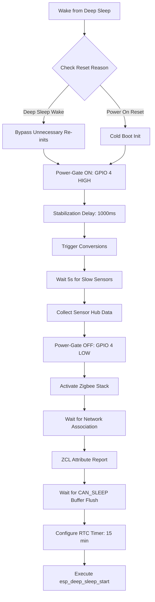

# Sleepy End Device (SED) Architecture Guide

This document describes the firmware architecture for the ultra-low-power Zigbee Sleepy End Device (SED) running on the ESP32-H2 microcontroller.

---

## 1. Core Architectural Paradigm (>99% Deep Sleep)

To achieve maximum battery life (targeting ~7µA sleep current), the device avoids infinite loop task polling. Instead, it executes a strict transient linear pipeline on each boot/wake cycle, writes attributes, and immediately returns to deep sleep.

### Sequential Workflow



---

## 2. Hardware Sensor Hub (`sensor_hub.c`) & Universal Registry

The sensor hub encapsulates the low-level drivers, math compensation algorithms, and timing routines for the attached physical sensors. Power gating is managed via `GPIO_NUM_4`.

For modularity, the system uses a **Universal Sensor Plugin Architecture** in `components/sensor_universal` where sensor drivers register themselves via `SENSOR_REGISTER()` macros and implement a common `sensor_ops_t` vtable.

### Shared I2C Master Bus Architecture
In multi-sensor systems, instantiating separate I2C master buses per driver causes runtime resource conflicts and compiler warnings. The codebase resolves this with a shared master bus allocator:
- The first driver to initialize calls `sensor_registry_get_i2c_bus()`, which sets up the master bus handle on `I2C_NUM_0`.
- All I2C device drivers (`BME280`, `BH1750`, `VEML7700`, `SCD41`, `SHT4x`, `SHT30`, `AHT20`) fetch this shared handle and register themselves as devices using `i2c_master_bus_add_device()`.
- To prevent disrupting other active sensors, individual drivers **never** call `i2c_del_master_bus()`. They only detach their devices via `i2c_master_bus_rm_device()` on deinitialization.

### Thread Safety & Concurrency
For bit-banged protocols on non-I2C pins (1-Wire for `DS18B20` and 2-wire serial for `HX711`), precise sub-microsecond timing is required. These drivers employ file-scope static `portMUX_TYPE` spinlocks and run timing-critical segments inside FreeRTOS critical sections:
```c
static portMUX_TYPE s_ow_mux = portMUX_INITIALIZER_UNLOCKED;
// Entered inside bit-bang timing operations:
portENTER_CRITICAL(&s_ow_mux);
// Timing-critical GPIO reads/writes
portEXIT_CRITICAL(&s_ow_mux);
```

### Standard and Official Espressif Libraries
All drivers are written in strict compliance with Espressif coding guidelines and use standard, official Espressif SDK interfaces:
- **I2C Master Driver**: Uses modern `driver/i2c_master.h` driver for robust, thread-safe multi-device communication.
- **ADC Oneshot**: Uses `esp_adc/adc_oneshot.h` with curve-fitting voltage calibration (`esp_adc/adc_cali_scheme.h`) for the Capacitive Soil Moisture sensor.
- **UART Driver**: Uses `driver/uart.h` for ZE03-NH3 electrochemical gas sensor communications.
- **On-Chip Temp Sensor**: Uses `driver/temperature_sensor.h` to monitor on-die temperature.

### Sensor Matrix & Driver Details

1. **BME280 (I2C, Address 0x76)**:
   - Configured in **Forced Mode** for sleepy operation.
   - Reads Air Temperature, Relative Humidity, and Barometric Pressure.
   - Implements full double-precision floating-point compensation formulas.
   - Caches calibration parameters in RTC Retained memory to bypass slow I2C reads upon sleep wake cycles.

2. **BH1750 (I2C, Address 0x23)**:
   - Configured in **One-Time High-Resolution Mode**.
   - Measures Ambient Light Intensity in Lux.

3. **Vishay VEML7700 (I2C, Address 0x10)**:
   - High-accuracy ambient light sensor with gain x1, integration time 100ms, and Power Saving Mode (PSM) 1 enabled.
   - Applies 4th-order polynomial non-linearity correction for high lux (>1000 lux) measurements based on Vishay AN84323.

4. **Sensirion SCD41 (I2C, Address 0x62)**:
   - Implements **Single-Shot Low-Power Measurement** flow.
   - Measures CO2 density (ppm).
   - Wakes up from sleep, triggers conversion, waits 5 seconds, reads data, and returns to sleep.
   - Computes and validates CRC-8 (polynomial 0x31) on each 2-byte word.

5. **Capacitive Soil Moisture Probe v1.2 (ADC1 Channel 1 / GPIO2)**:
   - Samples analog voltage using ESP32-H2 12-bit SAR ADC with attenuation configured for 0–3.3V range.
   - Maps raw voltage linearly to Volumetric Water Content (VWC) % using wet/dry thresholds.

6. **DS18B20 (1-Wire, GPIO 5)**:
   - Implements precise bit-banged 1-Wire protocol timings using `esp_rom_delay_us()` to support RISC-V targets.
   - Reads Root-Zone Temperature and validates scratchpad CRC-8.

7. **Winsen ZE03-NH3 (UART1, TX=24, RX=23)**:
   - Interfaces via UART at 9600 bps.
   - Uses **Q&A Mode** transactions to request gas density values.
   - Verifies 9-byte packet checksums.

8. **JSN-SR04T Waterproof Ultrasonic Probe (Trig=0, Echo=1)**:
   - Measures Silo depth/water level.
   - Uses Trig pulse (>12us) and measures Echo duration via microsecond counts.

9. **HX711 Load Cell (SCK=10, DOUT=11)**:
   - Synchronous 24-bit clock-data protocol.
   - Measures structural weight in kilograms.

---

## 3. Zigbee Data Model & Multi-Endpoint Layout

To accommodate multiple sensors mapping to similar ZCL clusters, the device implements a multi-endpoint layout:

*   **Endpoint 1** (Environmental Platform):
    - **Basic Cluster (0x0000)**: Device identifier and properties.
    - **Power Configuration (0x0001)**: Battery voltage in tenths of a volt.
    - **Temperature Measurement (0x0402)**: Air temperature from BME280.
    - **Relative Humidity Measurement (0x0405)**: Humidity from BME280.
    - **Illuminance Measurement (0x0400)**: Ambient light from BH1750.
    - **Carbon Dioxide Measurement (0x040D)**: CO2 from SCD41.
    - **Custom Cluster (0xFF01)**: Custom Agricultural Extension cluster:
        - *Attribute 0x0001 (Soil Moisture)*: VWC% in hundredths of a percent.
        - *Attribute 0x0002 (Barometric Pressure)*: hPa in tenths of a hPa.
        - *Attribute 0x0003 (Silo Depth)*: cm.
        - *Attribute 0x0004 (Weight Scale)*: Grams.
*   **Endpoint 2** (Root-Zone Temp):
    - **Temperature Measurement (0x0402)**: Temperature from DS18B20.
*   **Endpoint 3** (Ammonia Gas Platform):
    - **Carbon Dioxide/Gas Concentration Measurement (0x040D)**: NH3 from Winsen ZE03.

---

## 4. Generic Compilation & Modular Selectivity

A compile-time configuration block in `sensor_hub.h` allows developer-level component exclusion:

```c
#define CONFIG_ENABLE_BME280        1
#define CONFIG_ENABLE_BH1750        1
#define CONFIG_ENABLE_SCD41         1
#define CONFIG_ENABLE_SOIL_MOISTURE 1
#define CONFIG_ENABLE_DS18B20       1
#define CONFIG_ENABLE_ZE03_NH3      1
#define CONFIG_ENABLE_JSN_SR04T     1
#define CONFIG_ENABLE_HX711         1
```

If a macro is set to `0`, its driver code is omitted, and its ZCL clusters are not registered.
